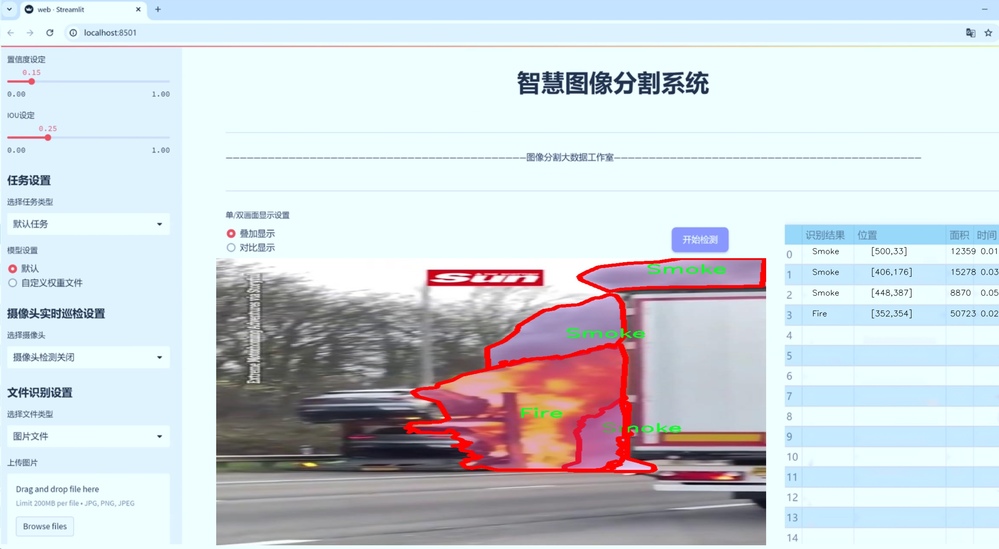
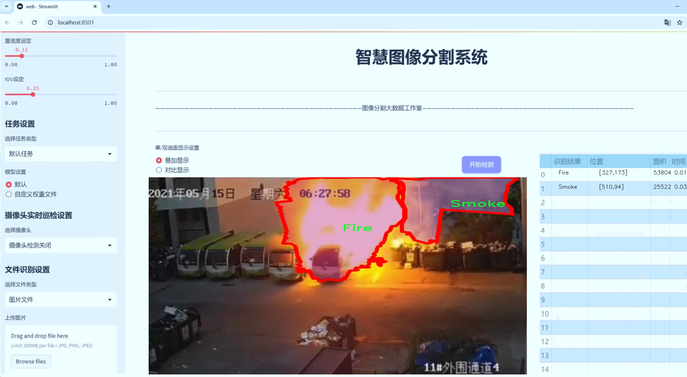
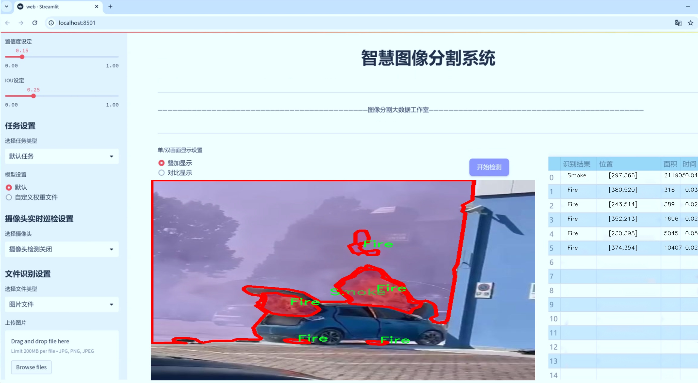
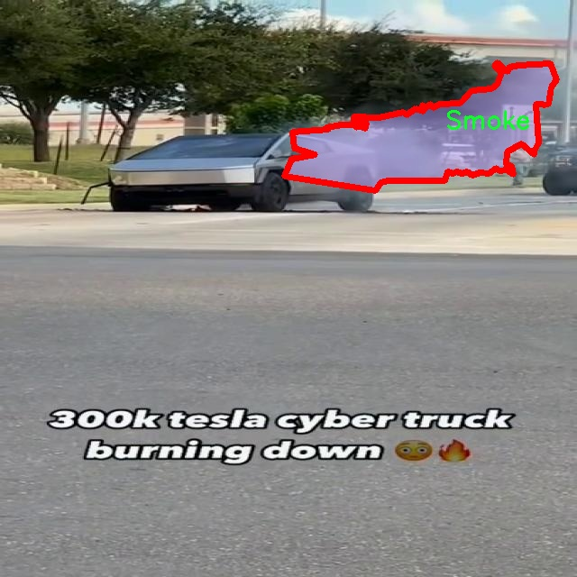
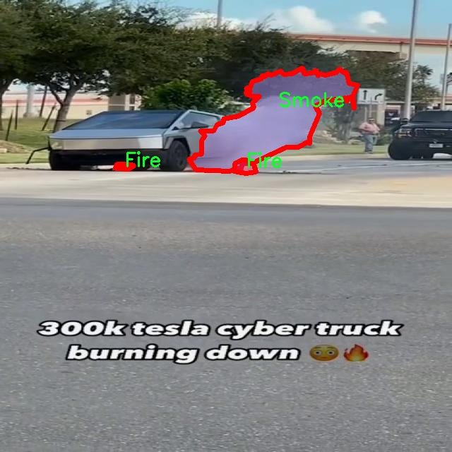
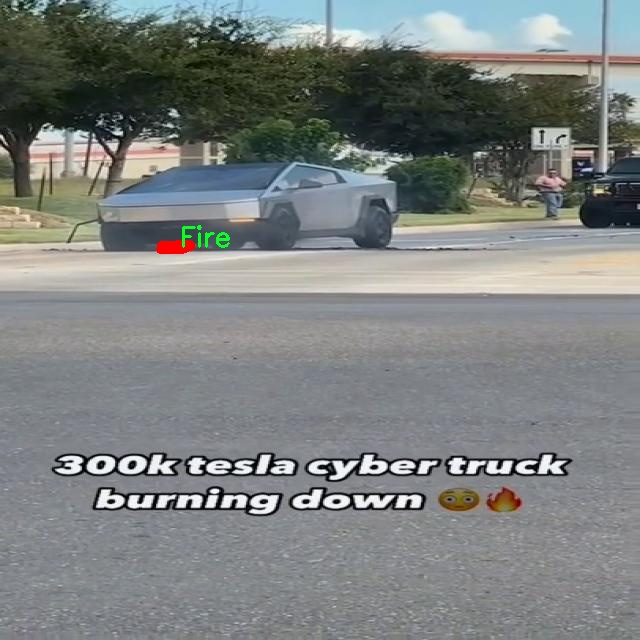
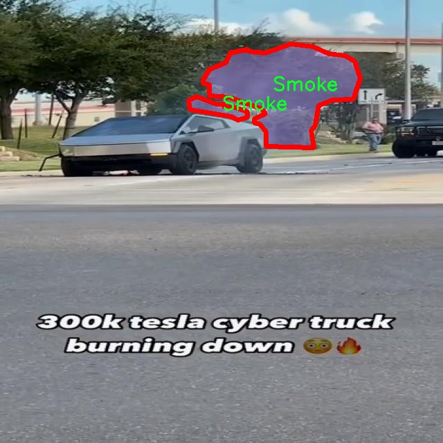
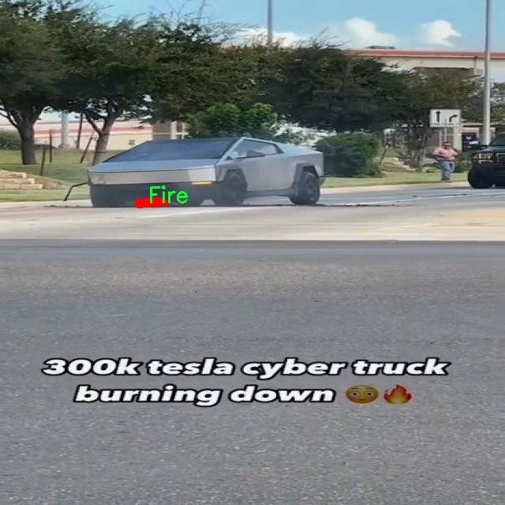

# 车辆自燃起火烟雾识别图像分割系统： yolov8-seg-RepHGNetV2

### 1.研究背景与意义

[参考博客](https://gitee.com/YOLOv8_YOLOv11_Segmentation_Studio/projects)

[博客来源](https://kdocs.cn/l/cszuIiCKVNis)

研究背景与意义

随着城市化进程的加快，机动车辆的数量不断增加，随之而来的交通安全问题也日益突出。其中，车辆自燃引发的火灾事故不仅对财产造成了巨大的损失，更严重威胁到人们的生命安全。根据相关统计数据，车辆自燃事故的发生频率逐年上升，尤其是在夏季高温天气条件下，车辆自燃的风险显著增加。因此，及时、准确地识别车辆自燃起火的烟雾和火焰，对于预防和减少火灾事故的发生具有重要的现实意义。

在这一背景下，图像处理技术的发展为车辆自燃的早期检测提供了新的解决方案。近年来，深度学习技术在计算机视觉领域取得了显著进展，尤其是目标检测和图像分割任务中，YOLO（You Only Look Once）系列模型因其高效性和准确性而受到广泛关注。YOLOv8作为该系列的最新版本，结合了多种先进的深度学习技术，具备了更强的特征提取能力和实时处理能力。然而，传统的YOLOv8模型在处理复杂场景下的烟雾和火焰识别时，仍然面临着一定的挑战，尤其是在背景复杂、光照变化等情况下，识别的准确性和鲁棒性有待提高。

本研究旨在基于改进的YOLOv8模型，构建一个高效的车辆自燃起火烟雾识别图像分割系统。为此，我们将利用一个包含3000张图像的数据集，该数据集专注于两个主要类别：火焰和烟雾。这一数据集的构建为模型的训练和测试提供了丰富的样本，能够有效提升模型在实际应用中的识别能力。通过对图像进行实例分割，我们不仅可以识别出火焰和烟雾的存在，还能够准确地定位其在图像中的具体位置，这对于火灾的早期预警和应急响应具有重要的指导意义。

此外，改进YOLOv8模型的研究还将推动车辆自燃检测技术的进一步发展。通过引入新的特征提取方法和数据增强技术，我们希望能够提高模型在不同环境条件下的适应性，增强其对各种复杂场景的识别能力。这不仅能够提升车辆自燃事故的检测效率，还能够为相关部门提供科学依据，帮助制定更为有效的安全管理措施。

综上所述，基于改进YOLOv8的车辆自燃起火烟雾识别图像分割系统的研究，不仅具有重要的理论价值，还具有广泛的应用前景。通过提升车辆自燃检测的准确性和实时性，我们能够为保障公共安全、减少火灾事故的发生做出积极贡献。同时，这一研究也为深度学习在安全监测领域的应用提供了新的思路和方法，推动了相关技术的进步与发展。

### 2.图片演示







注意：本项目提供完整的训练源码数据集和训练教程,由于此博客编辑较早,暂不提供权重文件（best.pt）,需要按照6.训练教程进行训练后实现上图效果。

### 3.视频演示

[3.1 视频演示](https://www.bilibili.com/video/BV1vRzGYwEVf/)

### 4.数据集信息

##### 4.1 数据集类别数＆类别名

nc: 2
names: ['Fire', 'Smoke']


##### 4.2 数据集信息简介

数据集信息展示是数据科学和机器学习领域中至关重要的一环。一个高质量的数据集通常包含多个维度的信息，包括数据的来源、数据类型、样本数量、特征描述、标签分布等。首先，数据集的来源应明确，以便用户了解数据的采集过程和背景。其次，数据类型可以是结构化的（如表格数据）或非结构化的（如图像、文本），这将影响后续的数据处理和分析方法。样本数量是评估数据集规模的重要指标，通常样本越多，模型的泛化能力越强。此外，特征描述应详细列出每个特征的含义、数据类型及其取值范围，以便于用户理解数据的结构。最后，标签分布的展示有助于识别数据集的类别不平衡问题，这对模型训练和评估具有重要影响。通过全面的信息展示，用户能够更好地选择和利用数据集，以实现更有效的研究和应用。











### 5.项目依赖环境部署教程（零基础手把手教学）

[5.1 环境部署教程链接（零基础手把手教学）](https://www.bilibili.com/video/BV1jG4Ve4E9t/?vd_source=bc9aec86d164b67a7004b996143742dc)


[5.2 安装Python虚拟环境创建和依赖库安装视频教程链接（零基础手把手教学）](https://www.bilibili.com/video/BV1nA4VeYEze/?vd_source=bc9aec86d164b67a7004b996143742dc)

### 6.手把手YOLOV8-seg训练视频教程（零基础手把手教学）

[6.1 手把手YOLOV8-seg训练视频教程（零基础小白有手就能学会）](https://www.bilibili.com/video/BV1cA4VeYETe/?vd_source=bc9aec86d164b67a7004b996143742dc)


按照上面的训练视频教程链接加载项目提供的数据集，运行train.py即可开始训练



     Epoch   gpu_mem       box       obj       cls    labels  img_size
     1/200     0G   0.01576   0.01955  0.007536        22      1280: 100%|██████████| 849/849 [14:42<00:00,  1.04s/it]
               Class     Images     Labels          P          R     mAP@.5 mAP@.5:.95: 100%|██████████| 213/213 [01:14<00:00,  2.87it/s]
                 all       3395      17314      0.994      0.957      0.0957      0.0843

     Epoch   gpu_mem       box       obj       cls    labels  img_size
     2/200     0G   0.01578   0.01923  0.007006        22      1280: 100%|██████████| 849/849 [14:44<00:00,  1.04s/it]
               Class     Images     Labels          P          R     mAP@.5 mAP@.5:.95: 100%|██████████| 213/213 [01:12<00:00,  2.95it/s]
                 all       3395      17314      0.996      0.956      0.0957      0.0845

     Epoch   gpu_mem       box       obj       cls    labels  img_size
     3/200     0G   0.01561    0.0191  0.006895        27      1280: 100%|██████████| 849/849 [10:56<00:00,  1.29it/s]
               Class     Images     Labels          P          R     mAP@.5 mAP@.5:.95: 100%|███████   | 187/213 [00:52<00:00,  4.04it/s]
                 all       3395      17314      0.996      0.957      0.0957      0.0845


### 7.50+种全套YOLOV8-seg创新点加载调参实验视频教程（一键加载写好的改进模型的配置文件）

[7.1 50+种全套YOLOV8-seg创新点加载调参实验视频教程（一键加载写好的改进模型的配置文件）](https://www.bilibili.com/video/BV1Hw4VePEXv/?vd_source=bc9aec86d164b67a7004b996143742dc)

### YOLOV8-seg算法简介

原始YOLOv8-seg算法原理

YOLOv8-seg算法是当前目标检测领域的前沿技术之一，其在YOLO系列算法的基础上进行了多项创新与优化，特别是在目标分割任务中的应用。YOLOv8-seg不仅继承了YOLOv5的高效特性，还融合了其他先进算法的设计理念，旨在实现更高的检测精度和更快的处理速度。该算法的核心思想是通过高效的特征提取和融合机制，结合改进的损失函数和样本匹配策略，来实现对复杂场景中目标的精准检测与分割。

在YOLOv8-seg的架构中，输入层、主干网络、特征融合层和解耦头构成了其基本框架。首先，YOLOv8-seg依然采用了CSPDarknet作为主干网络，但对其中的C3模块进行了优化，替换为更轻量的C2f模块。C2f模块通过引入ELAN（Efficient Layer Aggregation Network）思想，增强了特征图的流动性和重用性，从而有效缓解了深层网络中的梯度消失问题。C2f模块由多个CBS（Convolution + Batch Normalization + SiLU）结构组成，利用1x1卷积进行特征分支的构建，确保了特征提取的高效性与准确性。

特征融合层采用了PAN-FPN（Path Aggregation Network - Feature Pyramid Network）结构，该结构通过自下而上的特征融合，确保了不同尺度特征的充分利用。YOLOv8-seg在特征融合过程中，取消了上采样阶段中的卷积操作，直接将高层特征与中层特征进行拼接，这种设计使得网络能够更好地捕捉到目标的细节信息与语义信息，从而提高了检测的准确性。通过这种方式，YOLOv8-seg能够在处理复杂场景时，保持高效的特征提取能力，确保对目标的精准定位与分割。

在目标检测与分割的过程中，YOLOv8-seg采用了Anchor-Free的思想，摒弃了传统的Anchor-Base方法。这一创新使得模型在处理不同尺寸和形状的目标时，能够更加灵活与高效。YOLOv8-seg的损失函数设计也进行了显著改进，采用了VFLLoss（Variable Focal Loss）作为分类损失，并结合DFLLoss（Dynamic Focal Loss）和CIoULoss（Complete Intersection over Union Loss）来计算边界框的损失。这种新的损失策略不仅提高了模型对难以分类样本的关注度，还有效地解决了样本不平衡的问题，进一步提升了模型的整体性能。

样本匹配策略的改进也是YOLOv8-seg的一大亮点。该算法将静态匹配策略改为Task-Aligned的Assigner匹配方式，使得样本的匹配更加灵活与智能。这一策略通过动态调整样本的匹配方式，确保了每个样本在训练过程中都能得到充分的利用，从而提高了模型的学习效率和准确性。

在数据预处理方面，YOLOv8-seg延续了YOLOv5的策略，采用了马赛克增强、混合增强、空间扰动和颜色扰动等多种数据增强手段。这些增强技术的引入，使得模型在训练过程中能够更好地适应不同的场景与条件，提高了模型的泛化能力。

YOLOv8-seg的头部结构借鉴了YOLOX和YOLOv6的解耦头设计，取消了objectness分支，通过边框回归和目标分类的解耦，进一步提升了模型的检测精度。输出特征图的尺度为80x80、40x40和20x20，分别对应不同尺寸的目标，使得模型能够在多尺度的情况下进行高效的目标检测与分割。

综上所述，YOLOv8-seg算法通过一系列创新与优化，成功地在目标检测与分割领域实现了高效性与准确性的平衡。其在特征提取、特征融合、损失函数设计和样本匹配等方面的改进，使得YOLOv8-seg成为当前目标检测领域的一款具有里程碑意义的算法。未来，随着算法的不断优化与应用场景的扩展，YOLOv8-seg有望在更多实际应用中展现出其强大的性能与潜力。


### 9.系统功能展示（检测对象为举例，实际内容以本项目数据集为准）

图9.1.系统支持检测结果表格显示

  图9.2.系统支持置信度和IOU阈值手动调节

  图9.3.系统支持自定义加载权重文件best.pt(需要你通过步骤5中训练获得)

  图9.4.系统支持摄像头实时识别

  图9.5.系统支持图片识别

  图9.6.系统支持视频识别

  图9.7.系统支持识别结果文件自动保存

  图9.8.系统支持Excel导出检测结果数据


### 10.50+种全套YOLOV8-seg创新点原理讲解（非科班也可以轻松写刊发刊，V11版本正在科研待更新）

#### 10.1 由于篇幅限制，每个创新点的具体原理讲解就不一一展开，具体见下列网址中的创新点对应子项目的技术原理博客网址【Blog】：


[10.1 50+种全套YOLOV8-seg创新点原理讲解链接](https://gitee.com/qunmasj/good)

#### 10.2 部分改进模块原理讲解(完整的改进原理见上图和技术博客链接)【如果此小节的图加载失败可以通过CSDN或者Github搜索该博客的标题访问原始博客，原始博客图片显示正常】
### YOLOv8简介
#### Yolov8网络模型
Yolov8n的网络分为输入端、主干网( Back-bone) 、Neck模块和输出端4个部分（图4)。输
人端主要有马赛克( Mosaic）数据增强、自适应锚框计算和自适应灰度填充。主干网有Conv、C2和SPPF结构，其中，C2r模块是对残差特征进行学习的主要模块，该模块仿照Yolov7的ELAN结构,通过更多的分支跨层连接，丰富了模型的梯度流，可形成一个具有更强特征表示能力的神经网络模
块。Neck模块采用PAN ( path aggregation nelwOrk ,结构，可加强网络对不同缩放尺度对象特征融合的
能力。输出端将分类和检测过程进行解耦，主要包括损失计算和目标检测框筛选，其中，损失计算过程主要包括正负样本分配策略和 Loss计算，Yolov8n 网络主要使用TaskAlignedAssignerl 10]方法，即根据分类与回归的分数加权结果选择正样本;Loss计算包括分类和回归2个分支，无Ob-jecIness分支。分类分支依然采用BCE Loss，回归分支则使用了Distribution Focal Loss!11〕和CIOU( complele inlersection over union)损失函数。

### 可扩张残差（DWR）注意力模块
当前的许多工作直接采用多速率深度扩张卷积从一个输入特征图中同时捕获多尺度上下文信息，从而提高实时语义分割的特征提取效率。 然而，这种设计可能会因为结构和超参数的不合理而导致多尺度上下文信息的访问困难。 为了降低绘制多尺度上下文信息的难度，我们提出了一种高效的多尺度特征提取方法，该方法分解了原始的单步特征提取方法方法分为两个步骤，区域残差-语义残差。 在该方法中，多速率深度扩张卷积在特征提取中发挥更简单的作用：根据第一步提供的每个简明区域形式特征图，在第二步中使用一个所需的感受野执行简单的基于语义的形态过滤 一步，提高他们的效率。 此外，扩张率和扩张卷积的容量每个网络阶段都经过精心设计，以充分利用所有可以实现的区域形式的特征图。 因此，我们分别为高层和低层网络设计了一种新颖的扩张式残差（DWR）模块和简单倒置残差（SIR）模块。


首先，该博客引入了一个Dilation-wise Residual（DWR）模块，用于提取网络高层的特征，如图2a所示。多分支结构用于扩展感受野，其中每个分支采用不同空洞率的空洞深度卷积。
然后，专门设计了一个Simple Inverted Residual（SIR）模块来提取网络低层的特征，如图2b所示。该模块仅具有3×3的微小感受野，但使用inverted bottleneck式结构来扩展通道数量，确保更强的特征提取能力。
最后，基于DWR和SIR模块，构建了一个编码器-解码器风格的网络DWRSeg，其中解码器采用了简单的类似FCN的结构。解码器使用来自最后两个阶段的强语义信息直接对特征图进行上采样，然后将它们与来自较低阶段的特征图（包含丰富的详细信息）拼接起来，以进行最终预测。


### 11.项目核心源码讲解（再也不用担心看不懂代码逻辑）

#### 11.1 ultralytics\nn\extra_modules\orepa.py

以下是对给定代码的核心部分进行分析和详细注释的结果。代码主要实现了一个名为 `OREPA` 的模块，以及一些相关的卷积层和注意力机制。为了便于理解，我将保留最核心的部分，并添加详细的中文注释。

```python
import torch
import torch.nn as nn
import torch.nn.init as init
import torch.nn.functional as F
import numpy as np

# OREPA模块的实现
class OREPA(nn.Module):
    def __init__(self, in_channels, out_channels, kernel_size=3, stride=1, padding=None, groups=1, dilation=1, act=True):
        super(OREPA, self).__init__()
        
        # 激活函数的选择
        self.nonlinear = nn.ReLU() if act else nn.Identity()
        
        # 保存输入和输出通道数
        self.in_channels = in_channels
        self.out_channels = out_channels
        self.groups = groups
        
        # 计算填充
        padding = (kernel_size - 1) // 2 if padding is None else padding
        self.padding = padding
        self.stride = stride
        self.dilation = dilation
        
        # 定义卷积层参数
        self.weight_orepa_origin = nn.Parameter(torch.Tensor(out_channels, in_channels // groups, kernel_size, kernel_size))
        init.kaiming_uniform_(self.weight_orepa_origin, a=math.sqrt(0.0))  # 初始化权重
        
        # 其他卷积层参数
        self.weight_orepa_avg_conv = nn.Parameter(torch.Tensor(out_channels, in_channels // groups, 1, 1))
        init.kaiming_uniform_(self.weight_orepa_avg_conv, a=0.0)
        
        self.weight_orepa_1x1 = nn.Parameter(torch.Tensor(out_channels, in_channels // groups, 1, 1))
        init.kaiming_uniform_(self.weight_orepa_1x1, a=0.0)
        
        # BatchNorm层
        self.bn = nn.BatchNorm2d(out_channels)

    def weight_gen(self):
        # 生成权重
        weight_orepa_origin = self.weight_orepa_origin  # 原始卷积权重
        weight_orepa_avg = self.weight_orepa_avg_conv  # 平均卷积权重
        weight_orepa_1x1 = self.weight_orepa_1x1  # 1x1卷积权重
        
        # 合并所有权重
        weight = weight_orepa_origin + weight_orepa_avg + weight_orepa_1x1
        return weight

    def forward(self, inputs):
        # 前向传播
        weight = self.weight_gen()  # 生成权重
        out = F.conv2d(inputs, weight, stride=self.stride, padding=self.padding, dilation=self.dilation, groups=self.groups)  # 卷积操作
        return self.nonlinear(self.bn(out))  # 应用激活函数和BatchNorm

# 用于卷积和BatchNorm的组合类
class ConvBN(nn.Module):
    def __init__(self, in_channels, out_channels, kernel_size, stride=1, padding=0, dilation=1, groups=1):
        super().__init__()
        self.conv = nn.Conv2d(in_channels, out_channels, kernel_size, stride=stride, padding=padding, dilation=dilation, groups=groups, bias=False)
        self.bn = nn.BatchNorm2d(out_channels)  # BatchNorm层

    def forward(self, x):
        return self.bn(self.conv(x))  # 先卷积后BatchNorm

# OREPA_3x3_RepVGG模块的实现
class OREPA_3x3_RepVGG(nn.Module):
    def __init__(self, in_channels, out_channels, kernel_size=3, stride=1, padding=None, groups=1):
        super(OREPA_3x3_RepVGG, self).__init__()
        
        # 填充和其他参数的设置
        padding = (kernel_size - 1) // 2 if padding is None else padding
        self.padding = padding
        self.stride = stride
        self.groups = groups
        
        # 定义OREPA模块
        self.rbr_dense = OREPA(in_channels, out_channels, kernel_size=kernel_size, stride=stride, padding=padding, groups=groups)
        self.rbr_1x1 = ConvBN(in_channels, out_channels, kernel_size=1, stride=stride, groups=groups)

    def forward(self, inputs):
        # 前向传播
        out1 = self.rbr_dense(inputs)  # 通过OREPA模块
        out2 = self.rbr_1x1(inputs)  # 通过1x1卷积
        return out1 + out2  # 合并输出

# RepVGGBlock_OREPA模块的实现
class RepVGGBlock_OREPA(nn.Module):
    def __init__(self, in_channels, out_channels, kernel_size=3, stride=1, padding=None, groups=1):
        super(RepVGGBlock_OREPA, self).__init__()
        
        # 填充和其他参数的设置
        padding = (kernel_size - 1) // 2 if padding is None else padding
        self.padding = padding
        self.stride = stride
        self.groups = groups
        
        # 定义OREPA_3x3_RepVGG模块
        self.rbr_dense = OREPA_3x3_RepVGG(in_channels, out_channels, kernel_size=kernel_size, stride=stride, padding=padding, groups=groups)
        self.rbr_1x1 = ConvBN(in_channels, out_channels, kernel_size=1, stride=stride, groups=groups)

    def forward(self, inputs):
        # 前向传播
        out1 = self.rbr_dense(inputs)  # 通过OREPA模块
        out2 = self.rbr_1x1(inputs)  # 通过1x1卷积
        return out1 + out2  # 合并输出
```

### 代码核心部分的解释
1. **OREPA类**：实现了一个自定义的卷积层，支持多种卷积方式的组合（如原始卷积、平均卷积和1x1卷积），并在前向传播中使用这些卷积层的权重。
2. **ConvBN类**：组合了卷积和BatchNorm，简化了模型的构建。
3. **OREPA_3x3_RepVGG类**：使用OREPA模块和1x1卷积来构建一个3x3的卷积块。
4. **RepVGGBlock_OREPA类**：实现了一个包含多个卷积分支的块，支持残差连接。

以上是对代码的核心部分进行了提炼和详细注释，帮助理解其结构和功能。

这个文件定义了一个名为 `orepa.py` 的模块，主要用于实现一种新的卷积结构，称为 OREPA（Optimized Reparameterization for Efficient Convolution）。该模块使用 PyTorch 框架构建，包含多个类和函数，主要用于深度学习中的卷积神经网络（CNN）设计。

首先，文件导入了必要的库，包括 `torch` 和 `torch.nn`，以及一些用于卷积操作的自定义模块。`__all__` 列表定义了该模块公开的接口，包括 `OREPA`、`OREPA_LargeConv` 和 `RepVGGBlock_OREPA`。

接下来，定义了一些辅助函数，例如 `transI_fusebn` 和 `transVI_multiscale`，这些函数用于处理卷积核和批归一化（Batch Normalization）参数的转换和调整。

`OREPA` 类是该模块的核心部分，继承自 `nn.Module`。在初始化方法中，类接受多个参数，如输入通道数、输出通道数、卷积核大小、步幅、填充、分组卷积等。根据是否处于部署模式（`deploy`），类会选择不同的初始化方式。在非部署模式下，类定义了多个卷积核参数，并使用 Kaiming 初始化方法对它们进行初始化。`fre_init` 方法用于初始化一些特定的权重。

`weight_gen` 方法生成最终的卷积权重，结合了不同分支的权重，并根据向量 `vector` 的值进行加权。`forward` 方法实现了前向传播，执行卷积操作并应用非线性激活函数。

`OREPA_LargeConv` 类是对 `OREPA` 的扩展，主要用于处理较大的卷积核。它通过多个 `OREPA` 实例串联来构建更复杂的卷积结构。

`ConvBN` 类则实现了带有批归一化的卷积层，支持在部署模式下直接使用卷积层而不进行批归一化。

`OREPA_3x3_RepVGG` 类实现了一个特定的卷积结构，结合了 3x3 卷积和 1x1 卷积，并在需要时使用了 SEAttention 机制。

最后，`RepVGGBlock_OREPA` 类实现了一个复合块，结合了多个卷积层和批归一化层，并在前向传播中处理输入数据。

整体来看，这个模块提供了一种灵活且高效的卷积实现方式，适用于深度学习模型的构建，特别是在需要优化卷积操作时。

#### 11.2 ultralytics\nn\extra_modules\dynamic_snake_conv.py

以下是经过简化并添加详细中文注释的核心代码部分：

```python
import torch
import torch.nn as nn

class DySnakeConv(nn.Module):
    def __init__(self, inc, ouc, k=3) -> None:
        """
        初始化 DySnakeConv 模块
        :param inc: 输入通道数
        :param ouc: 输出通道数
        :param k: 卷积核大小
        """
        super().__init__()
        
        # 定义三个卷积层
        self.conv_0 = Conv(inc, ouc, k)  # 标准卷积
        self.conv_x = DSConv(inc, ouc, 0, k)  # 沿 x 轴的动态蛇卷积
        self.conv_y = DSConv(inc, ouc, 1, k)  # 沿 y 轴的动态蛇卷积
    
    def forward(self, x):
        """
        前向传播
        :param x: 输入特征图
        :return: 拼接后的输出特征图
        """
        # 将三个卷积的输出在通道维度上拼接
        return torch.cat([self.conv_0(x), self.conv_x(x), self.conv_y(x)], dim=1)

class DSConv(nn.Module):
    def __init__(self, in_ch, out_ch, morph, kernel_size=3, if_offset=True, extend_scope=1):
        """
        动态蛇卷积的初始化
        :param in_ch: 输入通道数
        :param out_ch: 输出通道数
        :param morph: 卷积核的形态（0: x 轴，1: y 轴）
        :param kernel_size: 卷积核大小
        :param if_offset: 是否需要偏移
        :param extend_scope: 扩展范围
        """
        super(DSConv, self).__init__()
        # 用于学习可变形偏移的卷积层
        self.offset_conv = nn.Conv2d(in_ch, 2 * kernel_size, 3, padding=1)
        self.bn = nn.BatchNorm2d(2 * kernel_size)  # 批归一化
        self.kernel_size = kernel_size

        # 定义沿 x 轴和 y 轴的动态蛇卷积
        self.dsc_conv_x = nn.Conv2d(in_ch, out_ch, kernel_size=(kernel_size, 1), stride=(kernel_size, 1), padding=0)
        self.dsc_conv_y = nn.Conv2d(in_ch, out_ch, kernel_size=(1, kernel_size), stride=(1, kernel_size), padding=0)

        self.extend_scope = extend_scope
        self.morph = morph
        self.if_offset = if_offset

    def forward(self, f):
        """
        前向传播
        :param f: 输入特征图
        :return: 经过动态蛇卷积后的特征图
        """
        # 计算偏移
        offset = self.offset_conv(f)
        offset = self.bn(offset)
        offset = torch.tanh(offset)  # 将偏移限制在 -1 到 1 之间

        # 进行可变形卷积
        dsc = DSC(f.shape, self.kernel_size, self.extend_scope, self.morph)
        deformed_feature = dsc.deform_conv(f, offset, self.if_offset)

        # 根据形态选择对应的卷积
        if self.morph == 0:
            x = self.dsc_conv_x(deformed_feature.type(f.dtype))
        else:
            x = self.dsc_conv_y(deformed_feature.type(f.dtype))

        return x

class DSC(object):
    def __init__(self, input_shape, kernel_size, extend_scope, morph):
        """
        动态蛇卷积的坐标映射和双线性插值
        :param input_shape: 输入特征图的形状
        :param kernel_size: 卷积核大小
        :param extend_scope: 扩展范围
        :param morph: 卷积核的形态
        """
        self.num_points = kernel_size
        self.width = input_shape[2]
        self.height = input_shape[3]
        self.morph = morph
        self.extend_scope = extend_scope

        # 定义特征图的形状
        self.num_batch = input_shape[0]
        self.num_channels = input_shape[1]

    def deform_conv(self, input, offset, if_offset):
        """
        执行可变形卷积
        :param input: 输入特征图
        :param offset: 偏移量
        :param if_offset: 是否使用偏移
        :return: 变形后的特征图
        """
        y, x = self._coordinate_map_3D(offset, if_offset)  # 计算坐标映射
        deformed_feature = self._bilinear_interpolate_3D(input, y, x)  # 进行双线性插值
        return deformed_feature

    # 省略 _coordinate_map_3D 和 _bilinear_interpolate_3D 方法的实现
```

### 代码说明：
1. **DySnakeConv 类**：定义了一个动态蛇卷积模块，包含三个卷积层：标准卷积和两个动态蛇卷积（分别沿 x 轴和 y 轴）。
2. **DSConv 类**：实现了动态蛇卷积的核心逻辑，包括偏移的学习和卷积的执行。
3. **DSC 类**：负责坐标映射和双线性插值，完成可变形卷积的具体实现。
4. **前向传播**：在 `forward` 方法中，输入特征图经过卷积处理后输出，最终将三个卷积的结果在通道维度上拼接。

此代码实现了一个具有动态可变形能力的卷积操作，适用于图像处理和计算机视觉任务。

这个程序文件定义了一个动态蛇形卷积（Dynamic Snake Convolution）模块，主要用于深度学习中的卷积操作。文件中包含两个主要的类：`DySnakeConv` 和 `DSConv`，以及一个辅助类 `DSC`。

`DySnakeConv` 类是一个卷积层的组合，它在初始化时接受输入通道数 `inc`、输出通道数 `ouc` 和卷积核大小 `k`。在其构造函数中，创建了三个卷积层：`conv_0` 是标准卷积，`conv_x` 和 `conv_y` 是动态蛇形卷积，分别沿着 x 轴和 y 轴进行卷积。在前向传播中，`DySnakeConv` 将这三个卷积的输出在通道维度上进行拼接，形成最终的输出。

`DSConv` 类实现了动态蛇形卷积的具体逻辑。它的构造函数接受输入通道数、输出通道数、卷积核大小、形态参数、是否需要偏移以及扩展范围等参数。`DSConv` 使用一个额外的卷积层 `offset_conv` 来学习偏移量，并通过批归一化进行处理。根据形态参数的不同，`DSConv` 可以选择在 x 轴或 y 轴上进行卷积。

在 `DSConv` 的前向传播中，首先计算偏移量，然后使用 `DSC` 类来进行坐标映射和特征图的变形卷积。`DSC` 类负责根据输入特征图的形状和卷积核的形态生成坐标映射，并通过双线性插值方法实现变形卷积。该类中定义了 `_coordinate_map_3D` 和 `_bilinear_interpolate_3D` 两个方法，前者生成变形后的坐标，后者根据这些坐标对输入特征图进行插值。

整体上，这个模块通过引入动态蛇形卷积的概念，能够在卷积操作中实现更灵活的特征提取，适应不同形态的输入数据，提升模型的表现。

#### 11.3 ultralytics\data\build.py

以下是经过简化和注释的核心代码部分：

```python
import os
import random
import numpy as np
import torch
from torch.utils.data import dataloader
from .dataset import YOLODataset
from .utils import PIN_MEMORY

class InfiniteDataLoader(dataloader.DataLoader):
    """
    自定义的无限数据加载器，继承自 PyTorch 的 DataLoader。
    该加载器可以无限循环使用工作线程。
    """

    def __init__(self, *args, **kwargs):
        """初始化 InfiniteDataLoader，设置批次采样器为重复采样器。"""
        super().__init__(*args, **kwargs)
        object.__setattr__(self, 'batch_sampler', _RepeatSampler(self.batch_sampler))
        self.iterator = super().__iter__()

    def __len__(self):
        """返回批次采样器的长度。"""
        return len(self.batch_sampler.sampler)

    def __iter__(self):
        """创建一个无限重复的迭代器。"""
        for _ in range(len(self)):
            yield next(self.iterator)

    def reset(self):
        """重置迭代器，便于在训练过程中修改数据集设置。"""
        self.iterator = self._get_iterator()


class _RepeatSampler:
    """
    无限重复的采样器。

    参数:
        sampler (Dataset.sampler): 要重复的采样器。
    """

    def __init__(self, sampler):
        """初始化重复采样器。"""
        self.sampler = sampler

    def __iter__(self):
        """无限迭代采样器的内容。"""
        while True:
            yield from iter(self.sampler)


def seed_worker(worker_id):
    """设置数据加载器工作线程的随机种子，以确保可重复性。"""
    worker_seed = torch.initial_seed() % 2 ** 32
    np.random.seed(worker_seed)
    random.seed(worker_seed)


def build_yolo_dataset(cfg, img_path, batch, data, mode='train', rect=False, stride=32):
    """构建 YOLO 数据集。"""
    return YOLODataset(
        img_path=img_path,
        imgsz=cfg.imgsz,
        batch_size=batch,
        augment=mode == 'train',  # 是否进行数据增强
        hyp=cfg,  # 超参数配置
        rect=cfg.rect or rect,  # 是否使用矩形批次
        cache=cfg.cache or None,
        single_cls=cfg.single_cls or False,
        stride=int(stride),
        pad=0.0 if mode == 'train' else 0.5,  # 训练时填充为0，验证时填充为0.5
        classes=cfg.classes,
        data=data,
        fraction=cfg.fraction if mode == 'train' else 1.0  # 训练时使用的样本比例
    )


def build_dataloader(dataset, batch, workers, shuffle=True, rank=-1):
    """返回用于训练或验证集的 InfiniteDataLoader 或 DataLoader。"""
    batch = min(batch, len(dataset))  # 确保批次不超过数据集大小
    nd = torch.cuda.device_count()  # CUDA 设备数量
    nw = min([os.cpu_count() // max(nd, 1), batch if batch > 1 else 0, workers])  # 工作线程数量
    sampler = None if rank == -1 else distributed.DistributedSampler(dataset, shuffle=shuffle)  # 分布式采样器
    generator = torch.Generator()
    generator.manual_seed(6148914691236517205 + RANK)  # 设置随机种子
    return InfiniteDataLoader(dataset=dataset,
                              batch_size=batch,
                              shuffle=shuffle and sampler is None,
                              num_workers=nw,
                              sampler=sampler,
                              pin_memory=PIN_MEMORY,
                              worker_init_fn=seed_worker,  # 初始化工作线程时设置随机种子
                              generator=generator)
```

### 代码注释说明：
1. **InfiniteDataLoader**: 自定义的数据加载器，支持无限循环使用工作线程，适合需要不断训练的场景。
2. **_RepeatSampler**: 实现了一个无限重复的采样器，能够不断从给定的采样器中获取数据。
3. **seed_worker**: 设置随机种子以确保数据加载的可重复性，避免每次训练时数据顺序的随机变化。
4. **build_yolo_dataset**: 构建 YOLO 数据集，支持多种配置选项，如数据增强、批次大小、填充等。
5. **build_dataloader**: 创建数据加载器，配置批次大小、工作线程数量、分布式采样等，返回一个可用于训练或验证的加载器。

这个程序文件是Ultralytics YOLO（You Only Look Once）项目的一部分，主要用于构建数据集和数据加载器，以便进行目标检测任务。代码中包含了多个类和函数，以下是对其主要内容的讲解。

首先，程序导入了一些必要的库，包括操作系统相关的库、随机数生成库、路径处理库、NumPy、PyTorch、PIL（Python Imaging Library）以及一些Ultralytics特定的模块。这些库为后续的数据处理和模型训练提供了基础。

接下来，定义了一个名为`InfiniteDataLoader`的类，它继承自PyTorch的`DataLoader`。这个类的主要功能是创建一个可以无限循环使用的加载器，适用于需要不断迭代数据的场景。它重写了`__len__`和`__iter__`方法，使得数据加载器可以在没有结束的情况下持续提供数据。此外，`reset`方法允许在训练过程中重置迭代器，以便可以修改数据集的设置。

在`InfiniteDataLoader`中，使用了一个私有类`_RepeatSampler`，该类实现了一个可以无限重复的采样器。它的`__iter__`方法通过不断迭代给定的采样器来实现这一功能。

接着，定义了一个`seed_worker`函数，用于设置数据加载器工作线程的随机种子。这对于确保在多线程环境中生成可重复的随机数是非常重要的。

`build_yolo_dataset`函数用于构建YOLO数据集。它接受多个参数，包括配置、图像路径、批次大小等。根据传入的参数，函数会创建一个`YOLODataset`实例，并配置数据增强、类别、缓存等选项。

`build_dataloader`函数则用于返回一个`InfiniteDataLoader`或标准的`DataLoader`，具体取决于传入的数据集和其他参数。它计算可用的工作线程数量，并根据分布式训练的需要选择合适的采样器。

`check_source`函数用于检查输入源的类型，并返回相应的标志值。它支持多种输入类型，包括文件路径、URL、图像、视频流等，并根据输入类型进行相应的处理。

最后，`load_inference_source`函数用于加载推理源，支持多种输入类型，并根据输入类型选择合适的数据加载方式。该函数还会应用必要的转换，以确保输入数据适合模型进行推理。

总体来说，这个程序文件的核心功能是提供灵活的数据加载和处理机制，以支持YOLO模型的训练和推理。通过使用自定义的数据加载器和数据集类，程序能够高效地处理各种输入源，并在训练过程中进行必要的配置和调整。

#### 11.4 ultralytics\utils\benchmarks.py

以下是代码中最核心的部分，并附上详细的中文注释：

```python
import time
import pandas as pd
from ultralytics import YOLO
from ultralytics.utils import select_device, check_yolo

def benchmark(model='yolov8n.pt', imgsz=160, device='cpu', verbose=False):
    """
    对YOLO模型进行基准测试，评估不同格式的速度和准确性。

    参数:
        model (str): 模型文件的路径，默认为'yolov8n.pt'。
        imgsz (int): 用于基准测试的图像大小，默认为160。
        device (str): 运行基准测试的设备，可以是'cpu'或'cuda'，默认为'cpu'。
        verbose (bool): 如果为True，则在基准测试失败时抛出异常，默认为False。

    返回:
        df (pandas.DataFrame): 包含每种格式的基准测试结果的数据框，包括文件大小、指标和推理时间。
    """
    
    # 设置pandas显示选项
    pd.options.display.max_columns = 10
    pd.options.display.width = 120
    
    # 选择设备
    device = select_device(device, verbose=False)
    
    # 加载模型
    model = YOLO(model)

    results = []  # 存储结果的列表
    start_time = time.time()  # 记录开始时间

    # 遍历导出格式
    for i, (name, format, suffix, cpu, gpu) in export_formats().iterrows():
        emoji, filename = '❌', None  # 默认导出状态为失败
        try:
            # 检查设备支持情况
            if 'cpu' in device.type:
                assert cpu, 'CPU不支持推理'
            if 'cuda' in device.type:
                assert gpu, 'GPU不支持推理'

            # 导出模型
            if format == '-':
                filename = model.ckpt_path or model.cfg  # PyTorch格式
            else:
                filename = model.export(imgsz=imgsz, format=format, device=device, verbose=False)
                assert suffix in str(filename), '导出失败'
            emoji = '✅'  # 导出成功

            # 进行推理
            model.predict('path/to/sample/image.jpg', imgsz=imgsz, device=device)

            # 验证模型
            results_dict = model.val(data='path/to/dataset.yaml', batch=1, imgsz=imgsz, device=device)
            metric, speed = results_dict.results_dict['mAP'], results_dict.speed['inference']
            results.append([name, emoji, round(file_size(filename), 1), round(metric, 4), round(speed, 2)])
        except Exception as e:
            if verbose:
                raise e  # 如果verbose为True，则抛出异常
            results.append([name, emoji, None, None, None])  # 记录失败信息

    # 打印结果
    check_yolo(device=device)  # 打印系统信息
    df = pd.DataFrame(results, columns=['Format', 'Status', 'Size (MB)', 'Metric', 'Inference time (ms/im)'])

    # 记录基准测试完成信息
    end_time = time.time() - start_time
    print(f'基准测试完成，耗时: {end_time:.2f}s\n{df}\n')

    return df  # 返回结果数据框
```

### 代码说明：
1. **导入必要的库**：导入了时间、pandas、YOLO模型以及设备选择和检查函数。
2. **benchmark函数**：这是核心函数，用于对YOLO模型进行基准测试。
   - **参数**：接受模型路径、图像大小、设备类型和详细输出选项。
   - **设备选择**：使用`select_device`函数选择运行设备。
   - **模型加载**：通过`YOLO`类加载模型。
   - **结果存储**：使用列表`results`存储每种格式的测试结果。
   - **导出格式遍历**：遍历不同的模型导出格式，进行模型导出和推理。
   - **推理和验证**：进行推理并验证模型的准确性和速度。
   - **结果打印**：打印最终的基准测试结果，并返回结果数据框。

这个代码片段是对YOLO模型进行基准测试的核心部分，主要功能是导出模型、进行推理和验证，并记录和返回结果。

这个程序文件`ultralytics/utils/benchmarks.py`主要用于对YOLO模型进行基准测试，以评估其在不同格式下的速度和准确性。文件中包含了两个主要的类和一些函数，分别用于基准测试和模型性能分析。

首先，文件开头提供了使用说明，用户可以通过导入`ProfileModels`和`benchmark`来进行模型的基准测试。用户可以指定模型文件的路径和图像大小等参数，程序会输出不同格式模型的性能数据，包括文件大小、准确性指标和推理时间。

`benchmark`函数是进行基准测试的核心功能。它接受多个参数，包括模型路径、数据集、图像大小、是否使用半精度和整数量化、设备类型（CPU或GPU）等。函数内部会根据不同的导出格式（如PyTorch、ONNX、TensorRT等）进行模型的导出和推理，并记录每种格式的性能指标。最终，结果会以`pandas.DataFrame`的形式返回，并输出到日志文件中。

`ProfileModels`类则用于对多个模型进行性能分析。用户可以提供模型的路径，类会自动查找相关的模型文件，并进行性能测试。它支持对ONNX和TensorRT格式的模型进行基准测试，记录模型的速度和计算复杂度（FLOPs）。类中包含了多个方法，例如`get_files`用于获取模型文件，`profile`用于执行性能分析，`profile_tensorrt_model`和`profile_onnx_model`分别用于分析TensorRT和ONNX模型的性能。

整个程序通过使用`numpy`和`torch`等库来进行数值计算和模型推理，同时也使用了`pandas`来处理和展示基准测试结果。程序中还包含了一些错误处理和日志记录功能，以便于用户在测试过程中获取必要的信息和调试信息。

总结来说，这个文件提供了一套完整的工具，用于评估YOLO模型在不同格式下的性能，帮助用户选择最适合其应用场景的模型格式。

#### 11.5 ultralytics\models\yolo\model.py

```python
# 导入必要的模块和类
from ultralytics.engine.model import Model
from ultralytics.models import yolo  # noqa
from ultralytics.nn.tasks import ClassificationModel, DetectionModel, PoseModel, SegmentationModel

class YOLO(Model):
    """YOLO（You Only Look Once）目标检测模型的定义。"""

    @property
    def task_map(self):
        """将任务类型映射到相应的模型、训练器、验证器和预测器类。"""
        return {
            'classify': {  # 分类任务
                'model': ClassificationModel,  # 分类模型
                'trainer': yolo.classify.ClassificationTrainer,  # 分类训练器
                'validator': yolo.classify.ClassificationValidator,  # 分类验证器
                'predictor': yolo.classify.ClassificationPredictor,  # 分类预测器
            },
            'detect': {  # 检测任务
                'model': DetectionModel,  # 检测模型
                'trainer': yolo.detect.DetectionTrainer,  # 检测训练器
                'validator': yolo.detect.DetectionValidator,  # 检测验证器
                'predictor': yolo.detect.DetectionPredictor,  # 检测预测器
            },
            'segment': {  # 分割任务
                'model': SegmentationModel,  # 分割模型
                'trainer': yolo.segment.SegmentationTrainer,  # 分割训练器
                'validator': yolo.segment.SegmentationValidator,  # 分割验证器
                'predictor': yolo.segment.SegmentationPredictor,  # 分割预测器
            },
            'pose': {  # 姿态估计任务
                'model': PoseModel,  # 姿态模型
                'trainer': yolo.pose.PoseTrainer,  # 姿态训练器
                'validator': yolo.pose.PoseValidator,  # 姿态验证器
                'predictor': yolo.pose.PosePredictor,  # 姿态预测器
            },
        }
```

### 代码核心部分及注释说明：
1. **类定义**：
   - `class YOLO(Model)`：定义了一个名为 `YOLO` 的类，继承自 `Model` 类，表示一个 YOLO 目标检测模型。

2. **属性方法**：
   - `@property`：装饰器，表示 `task_map` 是一个属性方法，可以通过 `yolo.task_map` 访问。
   - `def task_map(self)`：定义了一个方法，返回一个字典，映射不同任务类型到相应的模型和工具。

3. **任务映射**：
   - `return { ... }`：返回一个字典，包含四种任务类型（分类、检测、分割、姿态估计），每种任务都映射到相应的模型、训练器、验证器和预测器。
   - 每个任务的映射包括：
     - `'model'`：对应的模型类。
     - `'trainer'`：用于训练的类。
     - `'validator'`：用于验证的类。
     - `'predictor'`：用于预测的类。

通过这种结构，YOLO 模型可以灵活地处理不同的计算机视觉任务。

这个程序文件定义了一个名为 `YOLO` 的类，继承自 `Model` 类，主要用于实现 YOLO（You Only Look Once）目标检测模型。YOLO 是一种流行的实时目标检测算法，能够在单次前向传播中同时进行目标分类和定位。

在 `YOLO` 类中，有一个名为 `task_map` 的属性，它返回一个字典，映射了不同任务类型（如分类、检测、分割和姿态估计）到相应的模型、训练器、验证器和预测器类。这个映射关系使得用户可以根据具体的任务类型方便地选择和使用相应的组件。

具体来说，`task_map` 字典的结构如下：

- 对于分类任务（`classify`），它映射到 `ClassificationModel` 作为模型，`ClassificationTrainer` 作为训练器，`ClassificationValidator` 作为验证器，以及 `ClassificationPredictor` 作为预测器。
- 对于检测任务（`detect`），它映射到 `DetectionModel`，`DetectionTrainer`，`DetectionValidator` 和 `DetectionPredictor`。
- 对于分割任务（`segment`），它映射到 `SegmentationModel`，`SegmentationTrainer`，`SegmentationValidator` 和 `SegmentationPredictor`。
- 对于姿态估计任务（`pose`），它映射到 `PoseModel`，`PoseTrainer`，`PoseValidator` 和 `PosePredictor`。

通过这种方式，`YOLO` 类能够灵活地支持多种计算机视觉任务，并为每种任务提供相应的模型和工具，便于开发者进行模型训练、验证和预测。

### 12.系统整体结构（节选）

### 整体功能和构架概括

Ultralytics YOLO 项目是一个用于目标检测的深度学习框架，旨在提供高效、灵活的模型训练和推理工具。项目的整体架构包括多个模块，每个模块负责特定的功能，协同工作以实现完整的目标检测流程。以下是对各个模块的功能概述：

1. **模型构建与定义**：提供不同的卷积结构和模型架构，以支持高效的特征提取和目标检测。
2. **数据处理**：实现数据集的构建和加载，支持多种输入格式，确保数据在训练和推理过程中能够高效流动。
3. **基准测试**：提供工具用于评估模型在不同格式下的性能，帮助用户选择最佳的模型格式。
4. **任务映射**：支持多种计算机视觉任务（如分类、检测、分割、姿态估计），通过映射不同的模型和训练工具，简化用户的使用流程。

### 文件功能整理表

| 文件路径                                      | 功能描述                                                                                       |
|-----------------------------------------------|-----------------------------------------------------------------------------------------------|
| `ultralytics/nn/extra_modules/orepa.py`     | 实现 OREPA 卷积结构，提供高效的卷积操作和特征提取，支持深度学习模型的构建。                      |
| `ultralytics/nn/extra_modules/dynamic_snake_conv.py` | 实现动态蛇形卷积，提供灵活的卷积操作，适应不同形态的输入数据，提升模型的表现。                  |
| `ultralytics/data/build.py`                  | 构建数据集和数据加载器，支持多种输入源，提供高效的数据处理机制以支持模型训练和推理。             |
| `ultralytics/utils/benchmarks.py`           | 提供基准测试工具，评估模型在不同格式下的性能，记录速度和准确性，帮助用户选择最佳模型格式。       |
| `ultralytics/models/yolo/model.py`          | 定义 YOLO 模型及其任务映射，支持多种计算机视觉任务，提供相应的模型、训练器和预测器类。          |

通过这些模块的协同工作，Ultralytics YOLO 项目能够为用户提供一个完整的目标检测解决方案，支持从数据处理到模型评估的整个流程。

### 13.图片、视频、摄像头图像分割Demo(去除WebUI)代码

在这个博客小节中，我们将讨论如何在不使用WebUI的情况下，实现图像分割模型的使用。本项目代码已经优化整合，方便用户将分割功能嵌入自己的项目中。
核心功能包括图片、视频、摄像头图像的分割，ROI区域的轮廓提取、类别分类、周长计算、面积计算、圆度计算以及颜色提取等。
这些功能提供了良好的二次开发基础。

### 核心代码解读

以下是主要代码片段，我们会为每一块代码进行详细的批注解释：

```python
import random
import cv2
import numpy as np
from PIL import ImageFont, ImageDraw, Image
from hashlib import md5
from model import Web_Detector
from chinese_name_list import Label_list

# 根据名称生成颜色
def generate_color_based_on_name(name):
    ......

# 计算多边形面积
def calculate_polygon_area(points):
    return cv2.contourArea(points.astype(np.float32))

...
# 绘制中文标签
def draw_with_chinese(image, text, position, font_size=20, color=(255, 0, 0)):
    image_pil = Image.fromarray(cv2.cvtColor(image, cv2.COLOR_BGR2RGB))
    draw = ImageDraw.Draw(image_pil)
    font = ImageFont.truetype("simsun.ttc", font_size, encoding="unic")
    draw.text(position, text, font=font, fill=color)
    return cv2.cvtColor(np.array(image_pil), cv2.COLOR_RGB2BGR)

# 动态调整参数
def adjust_parameter(image_size, base_size=1000):
    max_size = max(image_size)
    return max_size / base_size

# 绘制检测结果
def draw_detections(image, info, alpha=0.2):
    name, bbox, conf, cls_id, mask = info['class_name'], info['bbox'], info['score'], info['class_id'], info['mask']
    adjust_param = adjust_parameter(image.shape[:2])
    spacing = int(20 * adjust_param)

    if mask is None:
        x1, y1, x2, y2 = bbox
        aim_frame_area = (x2 - x1) * (y2 - y1)
        cv2.rectangle(image, (x1, y1), (x2, y2), color=(0, 0, 255), thickness=int(3 * adjust_param))
        image = draw_with_chinese(image, name, (x1, y1 - int(30 * adjust_param)), font_size=int(35 * adjust_param))
        y_offset = int(50 * adjust_param)  # 类别名称上方绘制，其下方留出空间
    else:
        mask_points = np.concatenate(mask)
        aim_frame_area = calculate_polygon_area(mask_points)
        mask_color = generate_color_based_on_name(name)
        try:
            overlay = image.copy()
            cv2.fillPoly(overlay, [mask_points.astype(np.int32)], mask_color)
            image = cv2.addWeighted(overlay, 0.3, image, 0.7, 0)
            cv2.drawContours(image, [mask_points.astype(np.int32)], -1, (0, 0, 255), thickness=int(8 * adjust_param))

            # 计算面积、周长、圆度
            area = cv2.contourArea(mask_points.astype(np.int32))
            perimeter = cv2.arcLength(mask_points.astype(np.int32), True)
            ......

            # 计算色彩
            mask = np.zeros(image.shape[:2], dtype=np.uint8)
            cv2.drawContours(mask, [mask_points.astype(np.int32)], -1, 255, -1)
            color_points = cv2.findNonZero(mask)
            ......

            # 绘制类别名称
            x, y = np.min(mask_points, axis=0).astype(int)
            image = draw_with_chinese(image, name, (x, y - int(30 * adjust_param)), font_size=int(35 * adjust_param))
            y_offset = int(50 * adjust_param)

            # 绘制面积、周长、圆度和色彩值
            metrics = [("Area", area), ("Perimeter", perimeter), ("Circularity", circularity), ("Color", color_str)]
            for idx, (metric_name, metric_value) in enumerate(metrics):
                ......

    return image, aim_frame_area

# 处理每帧图像
def process_frame(model, image):
    pre_img = model.preprocess(image)
    pred = model.predict(pre_img)
    det = pred[0] if det is not None and len(det)
    if det:
        det_info = model.postprocess(pred)
        for info in det_info:
            image, _ = draw_detections(image, info)
    return image

if __name__ == "__main__":
    cls_name = Label_list
    model = Web_Detector()
    model.load_model("./weights/yolov8s-seg.pt")

    # 摄像头实时处理
    cap = cv2.VideoCapture(0)
    while cap.isOpened():
        ret, frame = cap.read()
        if not ret:
            break
        ......

    # 图片处理
    image_path = './icon/OIP.jpg'
    image = cv2.imread(image_path)
    if image is not None:
        processed_image = process_frame(model, image)
        ......

    # 视频处理
    video_path = ''  # 输入视频的路径
    cap = cv2.VideoCapture(video_path)
    while cap.isOpened():
        ret, frame = cap.read()
        ......
```


### 14.完整训练+Web前端界面+50+种创新点源码、数据集获取


# [下载链接：https://mbd.pub/o/bread/Z5icm59u](https://mbd.pub/o/bread/Z5icm59u)